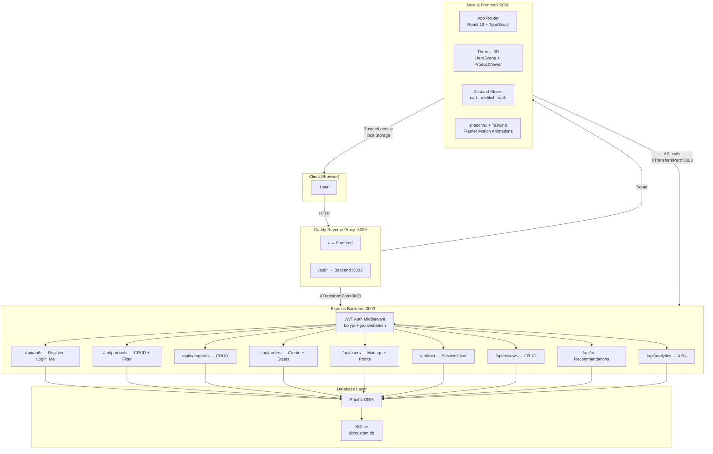
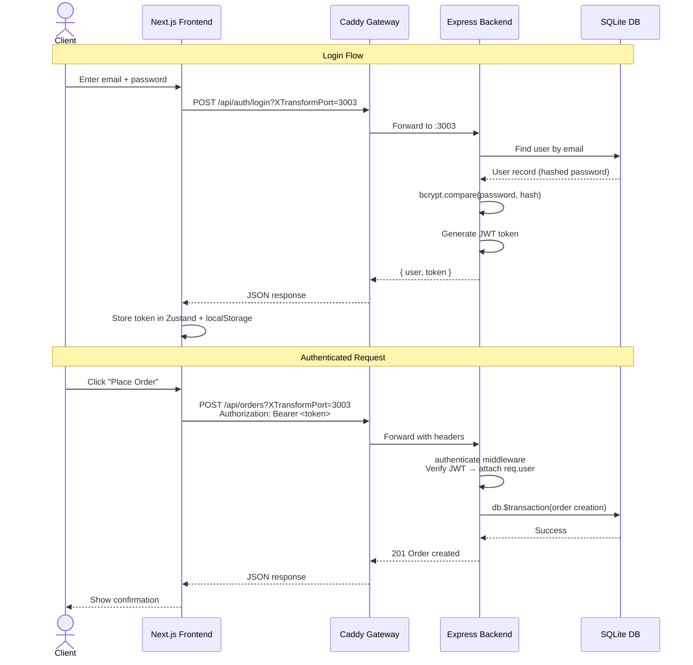
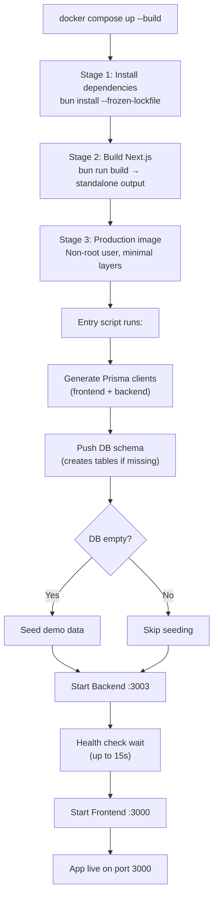
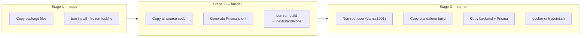
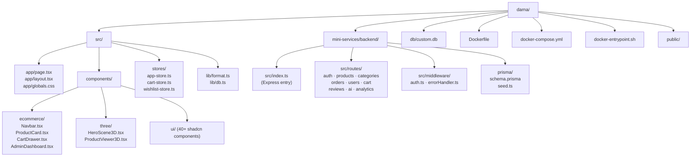

```mermaid
graph LR
    subgraph Public["Public (No Auth)"]
        P1[Browse products]
        P2[View categories]
        P3[Search catalog]
        P4[Register / Login]
    end

    subgraph Customer["Customer (JWT Token)"]
        C1[View profile]
        C2[Place orders]
        C3[Write reviews]
        C4[Manage cart]
        C5[Use wishlist]
        C6[Change password]
    end

    subgraph Admin["Admin (role=admin)"]
        A1[Admin dashboard]
        A2[CRUD products]
        A3[CRUD categories]
        A4[Manage orders]
        A5[Manage users]
        A6[View analytics]
        A7[Award points]
    end

    Public -->|"Login"| Customer
    Customer -->|"role=admin"| Admin
```

# Darna — Algerian Artisan E-Commerce Platform

> A premium, full-stack e-commerce platform celebrating Algerian craftsmanship.
> Built with Next.js 16, Node.js Express, Three.js & Prisma.

---

## Architecture



---

## Database Schema


---

## Data Flow — Authentication & Requests



---

## Roles & Permissions



---

## Tech Stack

| Layer | Technology |
|-------|-----------|
| Frontend | Next.js 16 (App Router), React 19, TypeScript 5 |
| 3D Engine | Three.js, @react-three/fiber, @react-three/drei |
| UI | shadcn/ui (New York), Tailwind CSS 4, Radix UI |
| Animations | Framer Motion 12 |
| State | Zustand 5 (persisted to localStorage) |
| Charts | Recharts 2 |
| Backend | Node.js Express 5, TypeScript |
| Runtime | Bun 1 |
| Database | SQLite + Prisma ORM 6 |
| Auth | JWT (jsonwebtoken) + bcryptjs |
| Security | Helmet, CORS |
| Proxy | Caddy |
| Container | Docker (multi-stage), Docker Compose |

---

## Getting Started Locally

### Prerequisites

- **[Bun](https://bun.sh/)** v1.0+ (install: `curl -fsSL https://bun.sh/install | bash`)
- **[Docker](https://docs.docker.com/get-docker/)** + Docker Compose (optional, for migration)
- **[Git](https://git-scm.com/)**

### Step 1 — Clone the repository

```bash
git clone <your-repo-url> darna
cd darna
```

### Step 2 — Install dependencies

```bash
# Frontend
bun install

# Backend
cd mini-services/backend
bun install
cd ../..
```

### Step 3 — Initialize the database

```bash
# Push Prisma schema (creates tables)
bun run db:push

cd mini-services/backend
bun run db:push

# Seed demo data (8 products, 5 categories, 2 users, badges...)
bun run seed

cd ../..
```

### Step 4 — Start both servers

You need **two terminals**:

```bash
# ─── Terminal 1: Backend API ───
cd mini-services/backend
bun run dev
# → Running on http://localhost:3003
```

```bash
# ─── Terminal 2: Next.js Frontend ───
bun run dev
# → Running on http://localhost:3000
```

### Step 5 — Open the app

Go to **http://localhost:3000** in your browser.

#### Demo Accounts

| Role | Email | Password |
|------|-------|----------|
| **Admin** | `admin@darna.dz` | `admin123` |
| **Customer** | `amina@email.com` | `amina123` |

---

## Migrating to Production with Docker

### How It Works



### Docker Build Details



### Step 1 — Build and launch

```bash
docker compose up -d --build
```

This single command:
- Builds the multi-stage Docker image
- Creates a persistent volume for the SQLite database
- Starts the container in detached mode
- Exposes port **3000**

### Step 2 — Verify it's running

```bash
# Check container status
docker compose ps

# View live logs
docker compose logs -f
```

You should see:
```
🚀 Starting backend API server...
   ✅ Backend is healthy (PID: ...)
🚀 Starting Next.js frontend on port 3000...
```

### Step 3 — Access the app

Open **http://localhost:3000** in your browser.

### Step 4 — Configure for production

Before going live, edit `docker-compose.yml`:

```yaml
environment:
  - JWT_SECRET=your-strong-random-secret-here   # <-- CHANGE THIS
  - JWT_EXPIRES_IN=7d
  - NODE_ENV=production
```

Then restart:

```bash
docker compose up -d --build --force-recreate
```

### Useful Docker Commands

| Command | Description |
|---------|-------------|
| `docker compose up -d --build` | Build & start |
| `docker compose logs -f` | Follow logs |
| `docker compose restart` | Restart container |
| `docker compose down` | Stop container (data preserved) |
| `docker compose down -v` | Stop + **delete database** |
| `docker compose up -d --build --force-recreate` | Full rebuild |

### Backing Up the Database

The SQLite file lives inside the Docker volume at `/app/db/custom.db`.

```bash
# Copy database out of the container
docker cp darna-ecommerce:/app/db/custom.db ./backup-$(date +%Y%m%d).db

# Restore from backup
docker cp ./backup-20250101.db darna-ecommerce:/app/db/custom.db
docker compose restart
```

---

## Project Structure



---

## API Endpoints Summary

```mermaid
graph LR
    subgraph Public["Public Endpoints"]
        PA["POST /api/auth/register"]
        PB["POST /api/auth/login"]
        PC["GET /api/products"]
        PD["GET /api/products/:id"]
        PE["GET /api/categories"]
        PF["GET /api/reviews/product/:id"]
        PG["GET /api/health"]
    end

    subgraph Auth["Authenticated (JWT)"]
        AA["GET /api/auth/me"]
        AB["PUT /api/auth/change-password"]
        AC["POST /api/orders"]
        AD["GET /api/orders/user/:id"]
        AE["POST /api/reviews"]
        AF["POST/PUT/DELETE /api/cart"]
        AG["GET/PUT /api/users/:id (own)"]
    end

    subgraph Admin["Admin Only (role=admin)"]
        AX["POST/PUT/DELETE /api/products"]
        AY["POST/PUT/DELETE /api/categories"]
        AZ["GET /api/orders"]
        BA["PATCH /api/orders/:id/status"]
        BB["GET /api/users"]
        BC["DELETE /api/users/:id"]
        BD["POST /api/users/:id/points"]
        BE["GET /api/analytics/summary"]
        BF["GET /api/ai/recommendations"]
    end

    Public -->|"Login"| Auth
    Auth -->|"role=admin"| Admin
```



---

## Environment Variables

| Variable | Default | Description |
|----------|---------|-------------|
| `NODE_ENV` | `development` | `development` or `production` |
| `DATABASE_URL` | `file:./db/custom.db` | Path to SQLite database |
| `PORT` | `3003` | Backend API port |
| `JWT_SECRET` | `darna-secret-key-2025` | **Must change in production** |
| `JWT_EXPIRES_IN` | `7d` | Token expiration time |

---
