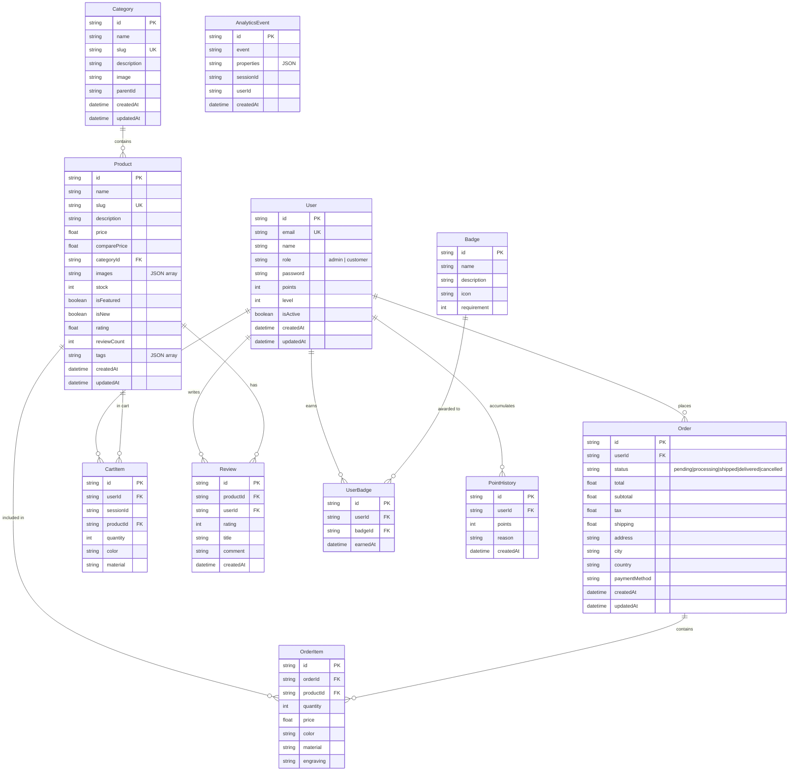
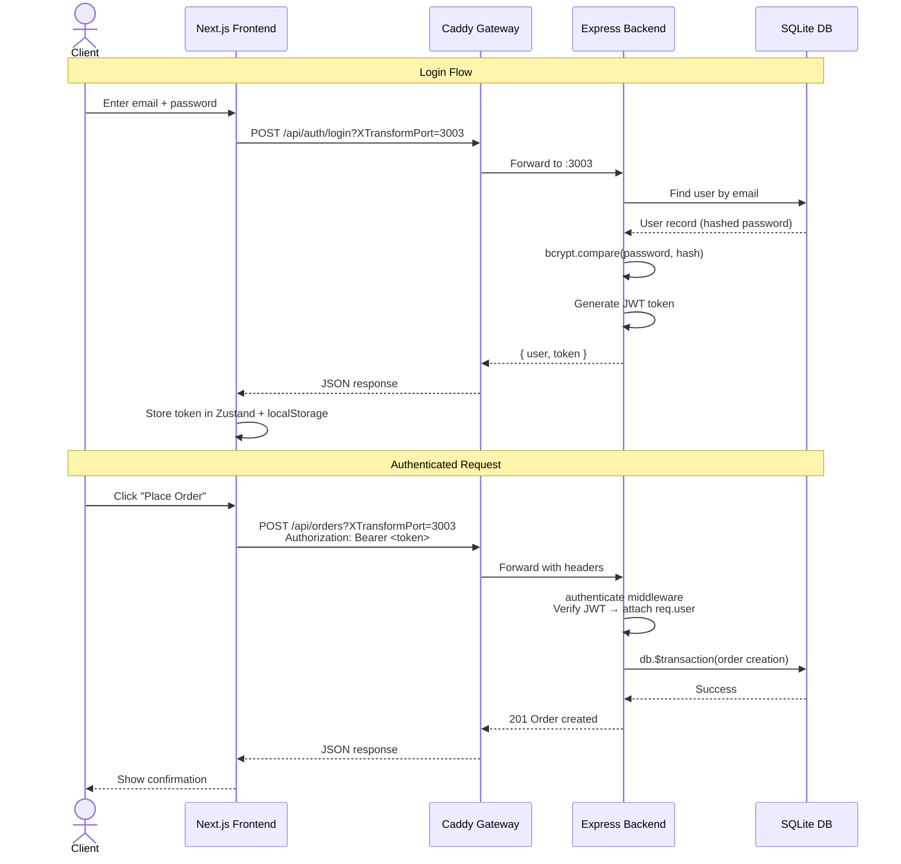
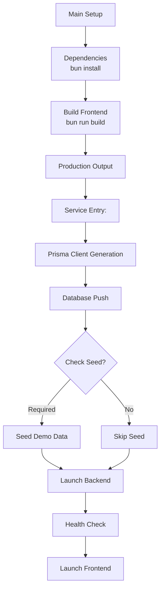
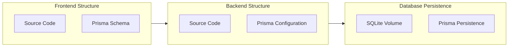
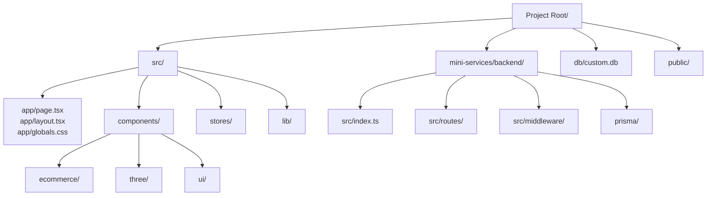

# Project Workflows

```mermaid
graph TB
    subgraph Client["Client (Browser)"]
        U[User]
    end

    subgraph Gateway["Caddy Reverse Proxy :3000"]
        C1["/ → Frontend"]
        C2["/api/* → Backend :3003"]
    end

    subgraph Frontend["Next.js Frontend :3000"]
        NX["App Router<br/>React 19 + TypeScript"]
        R3["Three.js 3D<br/>HeroScene + ProductViewer"]
        ZS["Zustand Stores<br/>cart · wishlist · auth"]
        SH["shadcn/ui + Tailwind<br/>Framer Motion Animations"]
    end

    subgraph Backend["Express Backend :3003"]
        AUTH["JWT Auth Middleware<br/>bcrypt + jsonwebtoken"]
        R1["/api/auth — Register, Login, Me"]
        R2["/api/products — CRUD + Filter"]
        R3B["/api/categories — CRUD"]
        R4["/api/orders — Create + Status"]
        R5["/api/users — Manage + Points"]
        R6["/api/cart — Session/User"]
        R7["/api/reviews — CRUD"]
        R8["/api/smart — Recommendations"]
        R9["/api/analytics — KPIs"]
    end

    subgraph DB["Database Layer"]
        PR["Prisma ORM"]
        SQ["SQLite<br/>db/custom.db"]
    end

    U -->|"HTTP"| Gateway
    Gateway -->|"Route"| Frontend
    Gateway -->|"XTransformPort=3003"| Backend
    Frontend -->|"API calls<br/>XTransformPort=3003"| Backend
    Frontend -->|"Zustand persist<br/>localStorage"| Client
    Backend --> AUTH
    AUTH --> R1 & R2 & R3B & R4 & R5 & R6 & R7 & R8 & R9
    R1 & R2 & R3B & R4 & R5 & R6 & R7 & R8 & R9 --> PR
    PR --> SQ
```

```mermaid
erDiagram
    User {
        string id PK
        string email UK
        string name
        string role "admin | customer"
        string password
        int points
        int level
        boolean isActive
        datetime createdAt
        datetime updatedAt
    }

    Category {
        string id PK
        string name
        string slug UK
        string description
        string image
        string parentId
        datetime createdAt
        datetime updatedAt
    }

    Product {
        string id PK
        string name
        string slug UK
        string description
        float price
        float comparePrice
        string categoryId FK
        string images "JSON array"
        int stock
        boolean isFeatured
        boolean isNew
        float rating
        int reviewCount
        string tags "JSON array"
        datetime createdAt
        datetime updatedAt
    }

    Order {
        string id PK
        string userId FK
        string status "pending|processing|shipped|delivered|cancelled"
        float total
        float subtotal
        float tax
        float shipping
        string address
        string city
        string country
        string paymentMethod
        datetime createdAt
        datetime updatedAt
    }

    OrderItem {
        string id PK
        string orderId FK
        string productId FK
        int quantity
        float price
        string color
        string material
        string engraving
    }

    CartItem {
        string id PK
        string userId FK
        string sessionId
        string productId FK
        int quantity
        string color
        string material
    }

    Review {
        string id PK
        string productId FK
        string userId FK
        int rating
        string title
        string comment
        datetime createdAt
    }

    Badge {
        string id PK
        string name
        string description
        string icon
        int requirement
    }

    UserBadge {
        string id PK
        string userId FK
        string badgeId FK
        datetime earnedAt
    }

    PointHistory {
        string id PK
        string userId FK
        int points
        string reason
        datetime createdAt
    }

    AnalyticsEvent {
        string id PK
        string event
        string properties "JSON"
        string sessionId
        string userId
        datetime createdAt
    }

    User ||--o{ Order : "places"
    User ||--o{ Review : "writes"
    User ||--o{ CartItem : "has"
    User ||--o{ UserBadge : "earns"
    User ||--o{ PointHistory : "accumulates"

    Category ||--o{ Product : "contains"

    Product ||--o{ OrderItem : "included in"
    Product ||--o{ Review : "has"
    Product ||--o{ CartItem : "in cart"

    Order ||--o{ OrderItem : "contains"

    Badge ||--o{ UserBadge : "awarded to"
```

```mermaid
sequenceDiagram
    actor C as Client
    participant F as Next.js Frontend
    participant G as Caddy Gateway
    participant B as Express Backend
    participant D as SQLite DB

    Note over C,D: Login Flow
    C->>F: Enter email + password
    F->>G: POST /api/auth/login?XTransformPort=3003
    G->>B: Forward to :3003
    B->>D: Find user by email
    D-->>B: User record (hashed password)
    B->>B: bcrypt.compare(password, hash)
    B->>B: Generate JWT token
    B-->>G: { user, token }
    G-->>F: JSON response
    F->>F: Store token in Zustand + localStorage

    Note over C,D: Authenticated Request
    C->>F: Click "Place Order"
    F->>G: POST /api/orders?XTransformPort=3003<br/>Authorization: Bearer <token>
    G->>B: Forward with headers
    B->>B: authenticate middleware<br/>Verify JWT → attach req.user
    B->>D: db.$transaction(order creation)
    D-->>B: Success
    B-->>G: 201 Order created
    G-->>F: JSON response
    F-->>C: Show confirmation
```

```mermaid
graph LR
    subgraph Public["Public (No Auth)"]
        P1[Browse products]
        P2[View categories]
        P3[Search catalog]
        P4[Register / Login]
    end

    subgraph Customer["Customer (JWT Token)"]
        C1[View profile]
        C2[Place orders]
        C3[Write reviews]
        C4[Manage cart]
        C5[Use wishlist]
        C6[Change password]
    end

    subgraph Admin["Admin (role=admin)"]
        A1[Admin dashboard]
        A2[CRUD products]
        A3[CRUD categories]
        A4[Manage orders]
        A5[Manage users]
        A6[View analytics]
        A7[Award points]
    end

    Public -->|"Login"| Customer
    Customer -->|"role=admin"| Admin
```

```mermaid
flowchart TD
    A["Main Setup"] --> B["Dependencies<br/>bun install"]
    B --> C["Build Frontend<br/>bun run build"]
    C --> D["Production Output"]
    D --> E["Service Entry:"]
    E --> F["Prisma Client Generation"]
    F --> G["Database Push"]
    G --> H{Check Seed?}
    H -->|Required| I["Seed Demo Data"]
    H -->|No| J["Skip Seed"]
    I --> K["Launch Backend"]
    J --> K
    K --> L["Health Check"]
    L --> M["Launch Frontend"]
```

```mermaid
graph LR
    subgraph Frontend["Frontend Structure"]
        S1A["Source Code"]
        S1B["Prisma Schema"]
    end

    subgraph Backend["Backend Structure"]
        S2A["Source Code"]
        S2B["Prisma Configuration"]
    end

    subgraph DB["Database Persistence"]
        S3A["SQLite Volume"]
        S3B["Prisma Persistence"]
    end

    Frontend --> Backend --> DB
```

```mermaid
graph TD
    ROOT["Project Root/"] --> SRC["src/"]
    ROOT --> MS["mini-services/backend/"]
    ROOT --> DB["db/custom.db"]
    ROOT --> PUB["public/"]

    SRC --> APP["app/page.tsx<br/>app/layout.tsx<br/>app/globals.css"]
    SRC --> COMP["components/"]
    SRC --> STORES["stores/"]
    SRC --> LIB["lib/"]

    COMP --> ECOM["ecommerce/"]
    COMP --> THREE["three/"]
    COMP --> UI["ui/"]

    MS --> IDX["src/index.ts"]
    MS --> ROUTES["src/routes/"]
    MS --> MW["src/middleware/"]
    MS --> PRISMA["prisma/"]
```

```mermaid
graph LR
    subgraph Public["API: Public"]
        PA["POST /api/auth/register"]
        PB["POST /api/auth/login"]
        PC["GET /api/products"]
        PD["GET /api/products/:id"]
        PE["GET /api/categories"]
        PF["GET /api/reviews/product/:id"]
        PG["GET /api/health"]
    end

    subgraph Auth["API: Authenticated (JWT)"]
        AA["GET /api/auth/me"]
        AB["PUT /api/auth/change-password"]
        AC["POST /api/orders"]
        AD["GET /api/orders/user/:id"]
        AE["POST /api/reviews"]
        AF["POST/PUT/DELETE /api/cart"]
        AG["GET/PUT /api/users/:id (own)"]
    end

    subgraph Admin["API: Admin Only"]
        AX["POST/PUT/DELETE /api/products"]
        AY["POST/PUT/DELETE /api/categories"]
        AZ["GET /api/orders"]
        BA["PATCH /api/orders/:id/status"]
        BB["GET /api/users"]
        BC["DELETE /api/users/:id"]
        BD["POST /api/users/:id/points"]
        BE["GET /api/analytics/summary"]
        BF["GET /api/smart/recommendations"]
    end

    Public -->|"Login"| Auth
    Auth -->|"role=admin"| Admin
```
